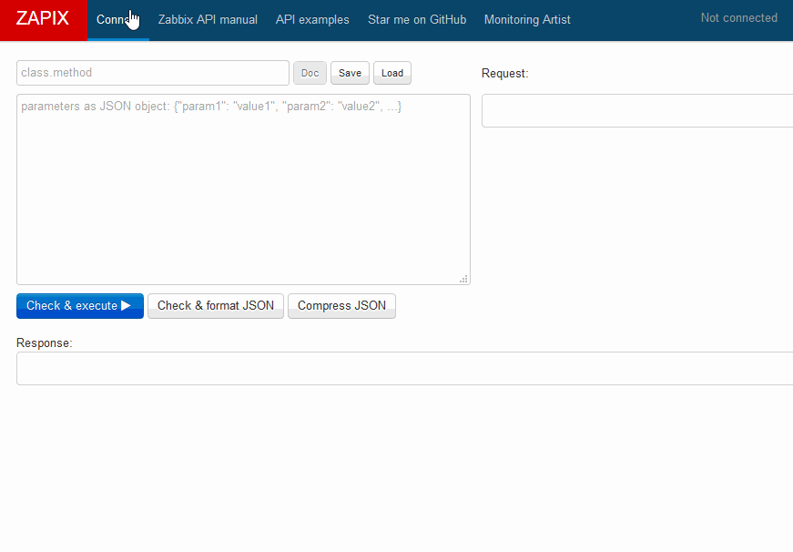

[](http://www.monitoringartist.com 'DevOps / Docker / Kubernetes / AWS ECS / Zabbix / Zenoss / Terraform / Monitoring')

# Zapix - online Zabbix API tool

Visit http://monitoringartist.github.io/zapix/ and test Zabbix API queries
in the browser. Autocomplete detects used Zabbix version (3.0/3.2/3.4) automatically
and it will offer only API methods and documentation related for connected Zabbix
version, however you can use still write older/newer methods manually. All
credentials are stored in your browser only. See [examples](#examples).

- If you want to use Docker, just build and run the image locally:
  ```shell
  docker build -t monitoringartist/zapix .
  docker run -p 8080:80 -d monitoringartist/zapix
  ```

- If you want to use Docker-compose with some basic http authentication (change user and password in .env file or use zapix/zapix), just run:
  ```shell
  docker-compose up -d
  ```

- After this, you can access http://localhost:8080 in your browser.


## Quick start

Connect to http://zabbix.org/zabbix/ (login guest, no password) and get all hosts:



Please donate to author, so he can continue to publish other awesome projects 
for free:

[](https://www.paypal.com/cgi-bin/webscr?cmd=_s-xclick&hosted_button_id=8LB6J222WRUZ4)

# Examples

- [host.get - with details and filter](http://monitoringartist.github.io/zapix/#apimethod=host.get&apiparams={%0A%20%20%20%20%22output%22%3A%20%22extend%22%2C%0A%20%20%20%20%22filter%22%3A%20{%0A%20%20%20%20%20%20%20%20%22host%22%3A%20[%0A%20%20%20%20%20%20%20%20%20%20%20%20%22Zabbix.org%22%2C%0A%20%20%20%20%20%20%20%20%20%20%20%20%22Linux%20server%22%0A%20%20%20%20%20%20%20%20]%0A%20%20%20%20}%0A})
- [trigger.get - with details and filter](http://monitoringartist.github.io/zapix/#apimethod=trigger.get&apiparams={%0A%20%20%20%20%22output%22%3A%20[%0A%20%20%20%20%20%20%20%20%22triggerid%22%2C%0A%20%20%20%20%20%20%20%20%22description%22%2C%0A%20%20%20%20%20%20%20%20%22priority%22%2C%0A%20%20%20%20%20%20%20%20%22error%22%0A%20%20%20%20]%2C%0A%20%20%20%20%22expandDescription%22%3A%201%2C%0A%20%20%20%20%22selectHosts%22%3A%20%22extend%22%2C%0A%20%20%20%20%22filter%22%3A%20{%0A%20%20%20%20%20%20%20%20%22value%22%3A%201%2C%0A%20%20%20%20%20%20%20%20%22status%22%3A%200%0A%20%20%20%20}%0A})
- [script.get - with details](http://monitoringartist.github.io/zapix/#apimethod=script.get&apiparams={%0A%20%20%20%20%22output%22%3A%20%22extend%22%0A})
- [maintenance.get - with details](http://monitoringartist.github.io/zapix/#apimethod=maintenance.get&apiparams=%7B%0A%20%20%20%20%22output%22%3A%20%22extend%22%2C%0A%20%20%20%20%22selectGroups%22%3A%20%22extend%22%2C%0A%20%20%20%20%22selectTimeperiods%22%3A%20%22extend%22%0A%7D)
- [event.get - with host and related objects](http://monitoringartist.github.io/zapix/#apimethod=event.get&apiparams=%7B%0A%20%20%20%20%22output%22%3A%20%22extend%22%2C%0A%20%20%20%20%22time_from%22%3A%20%221349797228%22%2C%0A%20%20%20%20%22time_till%22%3A%20%221350661228%22%2C%0A%20%20%20%20%22selectHosts%22%3A%20%22extend%22%2C%0A%20%20%20%20%22selectRelatedObject%22%3A%20%22extend%22%0A%7D)
- [user.get - with details](http://monitoringartist.github.io/zapix/#apimethod=user.get&apiparams={%0A%20%20%20%20%22output%22%3A%20%22extend%22%0A})
- [action.create - autoregistration + link to templates](http://monitoringartist.github.io/zapix/#apimethod=action.create&apiparams={%0A%20%20%20%20%22name%22%3A%20%22Auto%20registration%22%2C%0A%20%20%20%20%22eventsource%22%3A%202%2C%0A%20%20%20%20%22status%22%3A%200%2C%0A%20%20%20%20%22esc_period%22%3A%20120%2C%0A%20%20%20%20%22operations%22%3A%20[%0A%20%20%20%20%20%20%20%20{%0A%20%20%20%20%20%20%20%20%20%20%20%20%22operationtype%22%3A%206%2C%0A%20%20%20%20%20%20%20%20%20%20%20%20%22optemplate%22%3A%20[%0A%20%20%20%20%20%20%20%20%20%20%20%20%20%20%20%20{%0A%20%20%20%20%20%20%20%20%20%20%20%20%20%20%20%20%20%20%20%20%22templateid%22%3A%20%2210001%22%0A%20%20%20%20%20%20%20%20%20%20%20%20%20%20%20%20}%0A%20%20%20%20%20%20%20%20%20%20%20%20]%0A%20%20%20%20%20%20%20%20}%0A%20%20%20%20]%0A})
- [configuration.import - import template](http://monitoringartist.github.io/zapix/#apimethod=configuration.import&apiparams={%0A%20%20%20%20%22format%22%3A%20%22xml%22%2C%0A%20%20%20%20%22rules%22%3A%20{%0A%20%20%20%20%20%20%20%20%22templates%22%3A%20{%0A%20%20%20%20%20%20%20%20%20%20%20%20%22createMissing%22%3A%20true%2C%0A%20%20%20%20%20%20%20%20%20%20%20%20%22updateExisting%22%3A%20true%0A%20%20%20%20%20%20%20%20}%2C%0A%20%20%20%20%20%20%20%20%22images%22%3A%20{%0A%20%20%20%20%20%20%20%20%20%20%20%20%22createMissing%22%3A%20true%2C%0A%20%20%20%20%20%20%20%20%20%20%20%20%22updateExisting%22%3A%20true%0A%20%20%20%20%20%20%20%20}%2C%0A%20%20%20%20%20%20%20%20%22groups%22%3A%20{%0A%20%20%20%20%20%20%20%20%20%20%20%20%22createMissing%22%3A%20true%0A%20%20%20%20%20%20%20%20}%2C%0A%20%20%20%20%20%20%20%20%22triggers%22%3A%20{%0A%20%20%20%20%20%20%20%20%20%20%20%20%22createMissing%22%3A%20true%2C%0A%20%20%20%20%20%20%20%20%20%20%20%20%22updateExisting%22%3A%20true%0A%20%20%20%20%20%20%20%20}%2C%0A%20%20%20%20%20%20%20%20%22valueMaps%22%3A%20{%0A%20%20%20%20%20%20%20%20%20%20%20%20%22createMissing%22%3A%20true%2C%0A%20%20%20%20%20%20%20%20%20%20%20%20%22updateExisting%22%3A%20true%0A%20%20%20%20%20%20%20%20}%2C%0A%20%20%20%20%20%20%20%20%22hosts%22%3A%20{%0A%20%20%20%20%20%20%20%20%20%20%20%20%22createMissing%22%3A%20true%2C%0A%20%20%20%20%20%20%20%20%20%20%20%20%22updateExisting%22%3A%20true%0A%20%20%20%20%20%20%20%20}%2C%0A%20%20%20%20%20%20%20%20%22items%22%3A%20{%0A%20%20%20%20%20%20%20%20%20%20%20%20%22createMissing%22%3A%20true%2C%0A%20%20%20%20%20%20%20%20%20%20%20%20%22updateExisting%22%3A%20true%0A%20%20%20%20%20%20%20%20}%2C%0A%20%20%20%20%20%20%20%20%22maps%22%3A%20{%0A%20%20%20%20%20%20%20%20%20%20%20%20%22createMissing%22%3A%20true%2C%0A%20%20%20%20%20%20%20%20%20%20%20%20%22updateExisting%22%3A%20true%0A%20%20%20%20%20%20%20%20}%2C%0A%20%20%20%20%20%20%20%20%22screens%22%3A%20{%0A%20%20%20%20%20%20%20%20%20%20%20%20%22createMissing%22%3A%20true%2C%0A%20%20%20%20%20%20%20%20%20%20%20%20%22updateExisting%22%3A%20true%0A%20%20%20%20%20%20%20%20}%2C%0A%20%20%20%20%20%20%20%20%22templateScreens%22%3A%20{%0A%20%20%20%20%20%20%20%20%20%20%20%20%22createMissing%22%3A%20true%2C%0A%20%20%20%20%20%20%20%20%20%20%20%20%22updateExisting%22%3A%20true%0A%20%20%20%20%20%20%20%20}%2C%0A%20%20%20%20%20%20%20%20%22templateLinkage%22%3A%20{%0A%20%20%20%20%20%20%20%20%20%20%20%20%22createMissing%22%3A%20true%0A%20%20%20%20%20%20%20%20}%2C%0A%20%20%20%20%20%20%20%20%22applications%22%3A%20{%0A%20%20%20%20%20%20%20%20%20%20%20%20%22createMissing%22%3A%20true%2C%0A%20%20%20%20%20%20%20%20%20%20%20%20%22updateExisting%22%3A%20true%0A%20%20%20%20%20%20%20%20}%2C%0A%20%20%20%20%20%20%20%20%22graphs%22%3A%20{%0A%20%20%20%20%20%20%20%20%20%20%20%20%22createMissing%22%3A%20true%2C%0A%20%20%20%20%20%20%20%20%20%20%20%20%22updateExisting%22%3A%20true%0A%20%20%20%20%20%20%20%20}%2C%0A%20%20%20%20%20%20%20%20%22discoveryRules%22%3A%20{%0A%20%20%20%20%20%20%20%20%20%20%20%20%22createMissing%22%3A%20true%2C%0A%20%20%20%20%20%20%20%20%20%20%20%20%22updateExisting%22%3A%20true%0A%20%20%20%20%20%20%20%20}%0A%20%20%20%20}%2C%0A%20%20%20%20%22source%22%3A%20%22%3C%3Fxml%20version%3D\\%221.0\\%22%20encoding%3D\\%22UTF-8\\%22%3F%3E%3Czabbix_export%3E%3Cversion%3E2.0%3C%2Fversion%3E%3Cdate%3E2015-07-22T01%3A35%3A05Z%3C%2Fdate%3E%3Cgroups%3E%3Cgroup%3E%3Cname%3ETemplates%3C%2Fname%3E%3C%2Fgroup%3E%3C%2Fgroups%3E%3Ctemplates%3E%3Ctemplate%3E%3Ctemplate%3ETemplate%20App%20Docker%20-%20www.monitoringartist.com%3C%2Ftemplate%3E%3Cname%3ETemplate%20App%20Docker%20-%20www.monitoringartist.com%3C%2Fname%3E%3Cgroups%3E%3Cgroup%3E%3Cname%3ETemplates%3C%2Fname%3E%3C%2Fgroup%3E%3C%2Fgroups%3E%3Capplications%3E%3Capplication%3E%3Cname%3EDocker%3C%2Fname%3E%3C%2Fapplication%3E%3C%2Fapplications%3E%3Citems%2F%3E%3Cdiscovery_rules%3E%3Cdiscovery_rule%3E%3Cname%3ERunning%20containers%3C%2Fname%3E%3Ctype%3E0%3C%2Ftype%3E%3Csnmp_community%2F%3E%3Csnmp_oid%2F%3E%3Ckey%3Edocker.discovery%3C%2Fkey%3E%3Cdelay%3E600%3C%2Fdelay%3E%3Cstatus%3E0%3C%2Fstatus%3E%3Callowed_hosts%2F%3E%3Csnmpv3_contextname%2F%3E%3Csnmpv3_securityname%2F%3E%3Csnmpv3_securitylevel%3E0%3C%2Fsnmpv3_securitylevel%3E%3Csnmpv3_authprotocol%3E0%3C%2Fsnmpv3_authprotocol%3E%3Csnmpv3_authpassphrase%2F%3E%3Csnmpv3_privprotocol%3E0%3C%2Fsnmpv3_privprotocol%3E%3Csnmpv3_privpassphrase%2F%3E%3Cdelay_flex%2F%3E%3Cparams%2F%3E%3Cipmi_sensor%2F%3E%3Cauthtype%3E0%3C%2Fauthtype%3E%3Cusername%2F%3E%3Cpassword%2F%3E%3Cpublickey%2F%3E%3Cprivatekey%2F%3E%3Cport%2F%3E%3Cfilter%3E%3A%3C%2Ffilter%3E%3Clifetime%3E10%3C%2Flifetime%3E%3Cdescription%2F%3E%3Citem_prototypes%3E%3Citem_prototype%3E%3Cname%3EContainer%20{%23HCONTAINERID}%20is%20running%3C%2Fname%3E%3Ctype%3E0%3C%2Ftype%3E%3Csnmp_community%2F%3E%3Cmultiplier%3E0%3C%2Fmultiplier%3E%3Csnmp_oid%2F%3E%3Ckey%3Edocker.up[%2F{%23HCONTAINERID}]%3C%2Fkey%3E%3Cdelay%3E30%3C%2Fdelay%3E%3Chistory%3E90%3C%2Fhistory%3E%3Ctrends%3E365%3C%2Ftrends%3E%3Cstatus%3E0%3C%2Fstatus%3E%3Cvalue_type%3E3%3C%2Fvalue_type%3E%3Callowed_hosts%2F%3E%3Cunits%2F%3E%3Cdelta%3E0%3C%2Fdelta%3E%3Csnmpv3_contextname%2F%3E%3Csnmpv3_securityname%2F%3E%3Csnmpv3_securitylevel%3E0%3C%2Fsnmpv3_securitylevel%3E%3Csnmpv3_authprotocol%3E0%3C%2Fsnmpv3_authprotocol%3E%3Csnmpv3_authpassphrase%2F%3E%3Csnmpv3_privprotocol%3E0%3C%2Fsnmpv3_privprotocol%3E%3Csnmpv3_privpassphrase%2F%3E%3Cformula%3E1%3C%2Fformula%3E%3Cdelay_flex%2F%3E%3Cparams%2F%3E%3Cipmi_sensor%2F%3E%3Cdata_type%3E3%3C%2Fdata_type%3E%3Cauthtype%3E0%3C%2Fauthtype%3E%3Cusername%2F%3E%3Cpassword%2F%3E%3Cpublickey%2F%3E%3Cprivatekey%2F%3E%3Cport%2F%3E%3Cdescription%3ECheck%20if%20container%20is%20running%3A%26%2313%3B%201-is%20running%26%2313%3B%200-is%20not%20running%3C%2Fdescription%3E%3Cinventory_link%3E0%3C%2Finventory_link%3E%3Capplications%3E%3Capplication%3E%3Cname%3EDocker%3C%2Fname%3E%3C%2Fapplication%3E%3C%2Fapplications%3E%3Cvaluemap%3E%3Cname%3EService%20state%3C%2Fname%3E%3C%2Fvaluemap%3E%3Clogtimefmt%2F%3E%3C%2Fitem_prototype%3E%3Citem_prototype%3E%3Cname%3ECPU%20system%20time%20{%23HCONTAINERID}%3C%2Fname%3E%3Ctype%3E0%3C%2Ftype%3E%3Csnmp_community%2F%3E%3Cmultiplier%3E1%3C%2Fmultiplier%3E%3Csnmp_oid%2F%3E%3Ckey%3Edocker.cpu[%2F{%23HCONTAINERID}%2Csystem]%3C%2Fkey%3E%3Cdelay%3E30%3C%2Fdelay%3E%3Chistory%3E90%3C%2Fhistory%3E%3Ctrends%3E365%3C%2Ftrends%3E%3Cstatus%3E0%3C%2Fstatus%3E%3Cvalue_type%3E0%3C%2Fvalue_type%3E%3Callowed_hosts%2F%3E%3Cunits%3E%25%3C%2Funits%3E%3Cdelta%3E1%3C%2Fdelta%3E%3Csnmpv3_contextname%2F%3E%3Csnmpv3_securityname%2F%3E%3Csnmpv3_securitylevel%3E0%3C%2Fsnmpv3_securitylevel%3E%3Csnmpv3_authprotocol%3E0%3C%2Fsnmpv3_authprotocol%3E%3Csnmpv3_authpassphrase%2F%3E%3Csnmpv3_privprotocol%3E0%3C%2Fsnmpv3_privprotocol%3E%3Csnmpv3_privpassphrase%2F%3E%3Cformula%3E100%3C%2Fformula%3E%3Cdelay_flex%2F%3E%3Cparams%2F%3E%3Cipmi_sensor%2F%3E%3Cdata_type%3E0%3C%2Fdata_type%3E%3Cauthtype%3E0%3C%2Fauthtype%3E%3Cusername%2F%3E%3Cpassword%2F%3E%3Cpublickey%2F%3E%3Cprivatekey%2F%3E%3Cport%2F%3E%3Cdescription%2F%3E%3Cinventory_link%3E0%3C%2Finventory_link%3E%3Capplications%3E%3Capplication%3E%3Cname%3EDocker%3C%2Fname%3E%3C%2Fapplication%3E%3C%2Fapplications%3E%3Cvaluemap%2F%3E%3Clogtimefmt%2F%3E%3C%2Fitem_prototype%3E%3Citem_prototype%3E%3Cname%3ECPU%20user%20time%20{%23HCONTAINERID}%3C%2Fname%3E%3Ctype%3E0%3C%2Ftype%3E%3Csnmp_community%2F%3E%3Cmultiplier%3E1%3C%2Fmultiplier%3E%3Csnmp_oid%2F%3E%3Ckey%3Edocker.cpu[%2F{%23HCONTAINERID}%2Cuser]%3C%2Fkey%3E%3Cdelay%3E30%3C%2Fdelay%3E%3Chistory%3E90%3C%2Fhistory%3E%3Ctrends%3E365%3C%2Ftrends%3E%3Cstatus%3E0%3C%2Fstatus%3E%3Cvalue_type%3E0%3C%2Fvalue_type%3E%3Callowed_hosts%2F%3E%3Cunits%3E%25%3C%2Funits%3E%3Cdelta%3E1%3C%2Fdelta%3E%3Csnmpv3_contextname%2F%3E%3Csnmpv3_securityname%2F%3E%3Csnmpv3_securitylevel%3E0%3C%2Fsnmpv3_securitylevel%3E%3Csnmpv3_authprotocol%3E0%3C%2Fsnmpv3_authprotocol%3E%3Csnmpv3_authpassphrase%2F%3E%3Csnmpv3_privprotocol%3E0%3C%2Fsnmpv3_privprotocol%3E%3Csnmpv3_privpassphrase%2F%3E%3Cformula%3E100%3C%2Fformula%3E%3Cdelay_flex%2F%3E%3Cparams%2F%3E%3Cipmi_sensor%2F%3E%3Cdata_type%3E0%3C%2Fdata_type%3E%3Cauthtype%3E0%3C%2Fauthtype%3E%3Cusername%2F%3E%3Cpassword%2F%3E%3Cpublickey%2F%3E%3Cprivatekey%2F%3E%3Cport%2F%3E%3Cdescription%2F%3E%3Cinventory_link%3E0%3C%2Finventory_link%3E%3Capplications%3E%3Capplication%3E%3Cname%3EDocker%3C%2Fname%3E%3C%2Fapplication%3E%3C%2Fapplications%3E%3Cvaluemap%2F%3E%3Clogtimefmt%2F%3E%3C%2Fitem_prototype%3E%3Citem_prototype%3E%3Cname%3EUsed%20cache%20memory%20{%23HCONTAINERID}%3C%2Fname%3E%3Ctype%3E0%3C%2Ftype%3E%3Csnmp_community%2F%3E%3Cmultiplier%3E0%3C%2Fmultiplier%3E%3Csnmp_oid%2F%3E%3Ckey%3Edocker.mem[%2F{%23HCONTAINERID}%2Ctotal_cache]%3C%2Fkey%3E%3Cdelay%3E30%3C%2Fdelay%3E%3Chistory%3E90%3C%2Fhistory%3E%3Ctrends%3E365%3C%2Ftrends%3E%3Cstatus%3E0%3C%2Fstatus%3E%3Cvalue_type%3E3%3C%2Fvalue_type%3E%3Callowed_hosts%2F%3E%3Cunits%3EB%3C%2Funits%3E%3Cdelta%3E0%3C%2Fdelta%3E%3Csnmpv3_contextname%2F%3E%3Csnmpv3_securityname%2F%3E%3Csnmpv3_securitylevel%3E0%3C%2Fsnmpv3_securitylevel%3E%3Csnmpv3_authprotocol%3E0%3C%2Fsnmpv3_authprotocol%3E%3Csnmpv3_authpassphrase%2F%3E%3Csnmpv3_privprotocol%3E0%3C%2Fsnmpv3_privprotocol%3E%3Csnmpv3_privpassphrase%2F%3E%3Cformula%3E1%3C%2Fformula%3E%3Cdelay_flex%2F%3E%3Cparams%2F%3E%3Cipmi_sensor%2F%3E%3Cdata_type%3E0%3C%2Fdata_type%3E%3Cauthtype%3E0%3C%2Fauthtype%3E%3Cusername%2F%3E%3Cpassword%2F%3E%3Cpublickey%2F%3E%3Cprivatekey%2F%3E%3Cport%2F%3E%3Cdescription%2F%3E%3Cinventory_link%3E0%3C%2Finventory_link%3E%3Capplications%3E%3Capplication%3E%3Cname%3EDocker%3C%2Fname%3E%3C%2Fapplication%3E%3C%2Fapplications%3E%3Cvaluemap%2F%3E%3Clogtimefmt%2F%3E%3C%2Fitem_prototype%3E%3Citem_prototype%3E%3Cname%3EUsed%20RSS%20memory%20{%23HCONTAINERID}%3C%2Fname%3E%3Ctype%3E0%3C%2Ftype%3E%3Csnmp_community%2F%3E%3Cmultiplier%3E0%3C%2Fmultiplier%3E%3Csnmp_oid%2F%3E%3Ckey%3Edocker.mem[%2F{%23HCONTAINERID}%2Ctotal_rss]%3C%2Fkey%3E%3Cdelay%3E30%3C%2Fdelay%3E%3Chistory%3E90%3C%2Fhistory%3E%3Ctrends%3E365%3C%2Ftrends%3E%3Cstatus%3E0%3C%2Fstatus%3E%3Cvalue_type%3E3%3C%2Fvalue_type%3E%3Callowed_hosts%2F%3E%3Cunits%3EB%3C%2Funits%3E%3Cdelta%3E0%3C%2Fdelta%3E%3Csnmpv3_contextname%2F%3E%3Csnmpv3_securityname%2F%3E%3Csnmpv3_securitylevel%3E0%3C%2Fsnmpv3_securitylevel%3E%3Csnmpv3_authprotocol%3E0%3C%2Fsnmpv3_authprotocol%3E%3Csnmpv3_authpassphrase%2F%3E%3Csnmpv3_privprotocol%3E0%3C%2Fsnmpv3_privprotocol%3E%3Csnmpv3_privpassphrase%2F%3E%3Cformula%3E1%3C%2Fformula%3E%3Cdelay_flex%2F%3E%3Cparams%2F%3E%3Cipmi_sensor%2F%3E%3Cdata_type%3E0%3C%2Fdata_type%3E%3Cauthtype%3E0%3C%2Fauthtype%3E%3Cusername%2F%3E%3Cpassword%2F%3E%3Cpublickey%2F%3E%3Cprivatekey%2F%3E%3Cport%2F%3E%3Cdescription%2F%3E%3Cinventory_link%3E0%3C%2Finventory_link%3E%3Capplications%3E%3Capplication%3E%3Cname%3EDocker%3C%2Fname%3E%3C%2Fapplication%3E%3C%2Fapplications%3E%3Cvaluemap%2F%3E%3Clogtimefmt%2F%3E%3C%2Fitem_prototype%3E%3Citem_prototype%3E%3Cname%3EUsed%20swap%20{%23HCONTAINERID}%3C%2Fname%3E%3Ctype%3E0%3C%2Ftype%3E%3Csnmp_community%2F%3E%3Cmultiplier%3E0%3C%2Fmultiplier%3E%3Csnmp_oid%2F%3E%3Ckey%3Edocker.mem[%2F{%23HCONTAINERID}%2Ctotal_swap]%3C%2Fkey%3E%3Cdelay%3E30%3C%2Fdelay%3E%3Chistory%3E90%3C%2Fhistory%3E%3Ctrends%3E365%3C%2Ftrends%3E%3Cstatus%3E0%3C%2Fstatus%3E%3Cvalue_type%3E3%3C%2Fvalue_type%3E%3Callowed_hosts%2F%3E%3Cunits%3EB%3C%2Funits%3E%3Cdelta%3E0%3C%2Fdelta%3E%3Csnmpv3_contextname%2F%3E%3Csnmpv3_securityname%2F%3E%3Csnmpv3_securitylevel%3E0%3C%2Fsnmpv3_securitylevel%3E%3Csnmpv3_authprotocol%3E0%3C%2Fsnmpv3_authprotocol%3E%3Csnmpv3_authpassphrase%2F%3E%3Csnmpv3_privprotocol%3E0%3C%2Fsnmpv3_privprotocol%3E%3Csnmpv3_privpassphrase%2F%3E%3Cformula%3E1%3C%2Fformula%3E%3Cdelay_flex%2F%3E%3Cparams%2F%3E%3Cipmi_sensor%2F%3E%3Cdata_type%3E0%3C%2Fdata_type%3E%3Cauthtype%3E0%3C%2Fauthtype%3E%3Cusername%2F%3E%3Cpassword%2F%3E%3Cpublickey%2F%3E%3Cprivatekey%2F%3E%3Cport%2F%3E%3Cdescription%2F%3E%3Cinventory_link%3E0%3C%2Finventory_link%3E%3Capplications%3E%3Capplication%3E%3Cname%3EDocker%3C%2Fname%3E%3C%2Fapplication%3E%3C%2Fapplications%3E%3Cvaluemap%2F%3E%3Clogtimefmt%2F%3E%3C%2Fitem_prototype%3E%3C%2Fitem_prototypes%3E%3Ctrigger_prototypes%2F%3E%3Cgraph_prototypes%3E%3Cgraph_prototype%3E%3Cname%3ECPU%20utilization%20of%20{%23HCONTAINERID}%20container%3C%2Fname%3E%3Cwidth%3E900%3C%2Fwidth%3E%3Cheight%3E200%3C%2Fheight%3E%3Cyaxismin%3E0.0000%3C%2Fyaxismin%3E%3Cyaxismax%3E100.0000%3C%2Fyaxismax%3E%3Cshow_work_period%3E1%3C%2Fshow_work_period%3E%3Cshow_triggers%3E1%3C%2Fshow_triggers%3E%3Ctype%3E1%3C%2Ftype%3E%3Cshow_legend%3E1%3C%2Fshow_legend%3E%3Cshow_3d%3E0%3C%2Fshow_3d%3E%3Cpercent_left%3E0.0000%3C%2Fpercent_left%3E%3Cpercent_right%3E0.0000%3C%2Fpercent_right%3E%3Cymin_type_1%3E1%3C%2Fymin_type_1%3E%3Cymax_type_1%3E0%3C%2Fymax_type_1%3E%3Cymin_item_1%3E0%3C%2Fymin_item_1%3E%3Cymax_item_1%3E0%3C%2Fymax_item_1%3E%3Cgraph_items%3E%3Cgraph_item%3E%3Csortorder%3E0%3C%2Fsortorder%3E%3Cdrawtype%3E0%3C%2Fdrawtype%3E%3Ccolor%3E990000%3C%2Fcolor%3E%3Cyaxisside%3E0%3C%2Fyaxisside%3E%3Ccalc_fnc%3E2%3C%2Fcalc_fnc%3E%3Ctype%3E0%3C%2Ftype%3E%3Citem%3E%3Chost%3ETemplate%20App%20Docker%20-%20www.monitoringartist.com%3C%2Fhost%3E%3Ckey%3Edocker.cpu[%2F{%23HCONTAINERID}%2Csystem]%3C%2Fkey%3E%3C%2Fitem%3E%3C%2Fgraph_item%3E%3Cgraph_item%3E%3Csortorder%3E1%3C%2Fsortorder%3E%3Cdrawtype%3E0%3C%2Fdrawtype%3E%3Ccolor%3E000099%3C%2Fcolor%3E%3Cyaxisside%3E0%3C%2Fyaxisside%3E%3Ccalc_fnc%3E2%3C%2Fcalc_fnc%3E%3Ctype%3E0%3C%2Ftype%3E%3Citem%3E%3Chost%3ETemplate%20App%20Docker%20-%20www.monitoringartist.com%3C%2Fhost%3E%3Ckey%3Edocker.cpu[%2F{%23HCONTAINERID}%2Cuser]%3C%2Fkey%3E%3C%2Fitem%3E%3C%2Fgraph_item%3E%3C%2Fgraph_items%3E%3C%2Fgraph_prototype%3E%3Cgraph_prototype%3E%3Cname%3EMemory%20usage%20of%20{%23HCONTAINERID}%20container%3C%2Fname%3E%3Cwidth%3E900%3C%2Fwidth%3E%3Cheight%3E200%3C%2Fheight%3E%3Cyaxismin%3E0.0000%3C%2Fyaxismin%3E%3Cyaxismax%3E100.0000%3C%2Fyaxismax%3E%3Cshow_work_period%3E1%3C%2Fshow_work_period%3E%3Cshow_triggers%3E1%3C%2Fshow_triggers%3E%3Ctype%3E1%3C%2Ftype%3E%3Cshow_legend%3E1%3C%2Fshow_legend%3E%3Cshow_3d%3E0%3C%2Fshow_3d%3E%3Cpercent_left%3E0.0000%3C%2Fpercent_left%3E%3Cpercent_right%3E0.0000%3C%2Fpercent_right%3E%3Cymin_type_1%3E1%3C%2Fymin_type_1%3E%3Cymax_type_1%3E0%3C%2Fymax_type_1%3E%3Cymin_item_1%3E0%3C%2Fymin_item_1%3E%3Cymax_item_1%3E0%3C%2Fymax_item_1%3E%3Cgraph_items%3E%3Cgraph_item%3E%3Csortorder%3E0%3C%2Fsortorder%3E%3Cdrawtype%3E0%3C%2Fdrawtype%3E%3Ccolor%3E00C800%3C%2Fcolor%3E%3Cyaxisside%3E0%3C%2Fyaxisside%3E%3Ccalc_fnc%3E2%3C%2Fcalc_fnc%3E%3Ctype%3E0%3C%2Ftype%3E%3Citem%3E%3Chost%3ETemplate%20App%20Docker%20-%20www.monitoringartist.com%3C%2Fhost%3E%3Ckey%3Edocker.mem[%2F{%23HCONTAINERID}%2Ctotal_cache]%3C%2Fkey%3E%3C%2Fitem%3E%3C%2Fgraph_item%3E%3Cgraph_item%3E%3Csortorder%3E1%3C%2Fsortorder%3E%3Cdrawtype%3E0%3C%2Fdrawtype%3E%3Ccolor%3E0000C8%3C%2Fcolor%3E%3Cyaxisside%3E0%3C%2Fyaxisside%3E%3Ccalc_fnc%3E2%3C%2Fcalc_fnc%3E%3Ctype%3E0%3C%2Ftype%3E%3Citem%3E%3Chost%3ETemplate%20App%20Docker%20-%20www.monitoringartist.com%3C%2Fhost%3E%3Ckey%3Edocker.mem[%2F{%23HCONTAINERID}%2Ctotal_rss]%3C%2Fkey%3E%3C%2Fitem%3E%3C%2Fgraph_item%3E%3Cgraph_item%3E%3Csortorder%3E2%3C%2Fsortorder%3E%3Cdrawtype%3E0%3C%2Fdrawtype%3E%3Ccolor%3EEE0000%3C%2Fcolor%3E%3Cyaxisside%3E0%3C%2Fyaxisside%3E%3Ccalc_fnc%3E2%3C%2Fcalc_fnc%3E%3Ctype%3E0%3C%2Ftype%3E%3Citem%3E%3Chost%3ETemplate%20App%20Docker%20-%20www.monitoringartist.com%3C%2Fhost%3E%3Ckey%3Edocker.mem[%2F{%23HCONTAINERID}%2Ctotal_swap]%3C%2Fkey%3E%3C%2Fitem%3E%3C%2Fgraph_item%3E%3C%2Fgraph_items%3E%3C%2Fgraph_prototype%3E%3Cgraph_prototype%3E%3Cname%3EState%20of%20{%23HCONTAINERID}%20container%3C%2Fname%3E%3Cwidth%3E900%3C%2Fwidth%3E%3Cheight%3E200%3C%2Fheight%3E%3Cyaxismin%3E0.0000%3C%2Fyaxismin%3E%3Cyaxismax%3E100.0000%3C%2Fyaxismax%3E%3Cshow_work_period%3E1%3C%2Fshow_work_period%3E%3Cshow_triggers%3E1%3C%2Fshow_triggers%3E%3Ctype%3E0%3C%2Ftype%3E%3Cshow_legend%3E1%3C%2Fshow_legend%3E%3Cshow_3d%3E0%3C%2Fshow_3d%3E%3Cpercent_left%3E0.0000%3C%2Fpercent_left%3E%3Cpercent_right%3E0.0000%3C%2Fpercent_right%3E%3Cymin_type_1%3E1%3C%2Fymin_type_1%3E%3Cymax_type_1%3E0%3C%2Fymax_type_1%3E%3Cymin_item_1%3E0%3C%2Fymin_item_1%3E%3Cymax_item_1%3E0%3C%2Fymax_item_1%3E%3Cgraph_items%3E%3Cgraph_item%3E%3Csortorder%3E0%3C%2Fsortorder%3E%3Cdrawtype%3E0%3C%2Fdrawtype%3E%3Ccolor%3E000088%3C%2Fcolor%3E%3Cyaxisside%3E0%3C%2Fyaxisside%3E%3Ccalc_fnc%3E2%3C%2Fcalc_fnc%3E%3Ctype%3E0%3C%2Ftype%3E%3Citem%3E%3Chost%3ETemplate%20App%20Docker%20-%20www.monitoringartist.com%3C%2Fhost%3E%3Ckey%3Edocker.up[%2F{%23HCONTAINERID}]%3C%2Fkey%3E%3C%2Fitem%3E%3C%2Fgraph_item%3E%3C%2Fgraph_items%3E%3C%2Fgraph_prototype%3E%3C%2Fgraph_prototypes%3E%3Chost_prototypes%2F%3E%3C%2Fdiscovery_rule%3E%3C%2Fdiscovery_rules%3E%3Cmacros%2F%3E%3Ctemplates%2F%3E%3Cscreens%2F%3E%3C%2Ftemplate%3E%3C%2Ftemplates%3E%3C%2Fzabbix_export%3E%22%0A})

# Original project

https://bitbucket.org/Vedmak/zapix

# Zabbix API libraries

Visit [list of available Zabbix API libraries](https://monitoringartist.github.io/zabbix-searcher/#API).

# Author

[Devops Monitoring Expert](http://www.jangaraj.com 'DevOps / Docker / Kubernetes / AWS ECS / Google GCP / Zabbix / Zenoss / Terraform / Monitoring'),
who loves monitoring systems and cutting/bleeding edge technologies: Docker,
Kubernetes, ECS, AWS, Google GCP, Terraform, Lambda, Zabbix, Grafana, Elasticsearch,
Kibana, Prometheus, Sysdig, ...

Summary:
* 2000+ [GitHub](https://github.com/monitoringartist/) stars
* 10 000+ [Grafana dashboard](https://grafana.net/monitoringartist) downloads
* 1 000 000+ [Docker image](https://hub.docker.com/u/monitoringartist/) pulls

Professional devops / monitoring / consulting services:

[](http://www.monitoringartist.com 'DevOps / Docker / Kubernetes / AWS ECS / Google GCP / Zabbix / Zenoss / Terraform / Monitoring')
